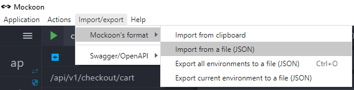
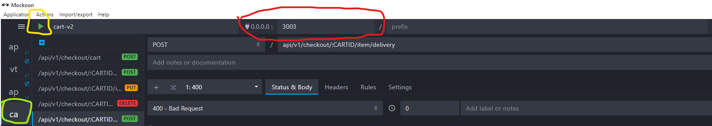

# APP Mockoon mocks e OpenAPI Docs
Mocks usando o [Mockoon](https://mockoon.com/)

## Importar um 'ENV'
Selecionar o menu conforme imagem abaixo.
  
E após isso selecionar um dos arquivos *.json desse repositorio.

## executar um 'ENV'
Para executar os mocks, após importado o ENV
 
 1. Selecionar o ENV, ( circulado em verde )
 2. Clicar no "PLAY" ( circulado em amarelo)
 3. Após isso os mocks ficam disponiveis conforme indicado pelo seleção em vermelho Ex. localhost:3003  


## Rodar o cli
Abrir um terminal na pasta ***mockoon-server***, e executar os seguintes comandos ( é necessario possuir o [nodejs](https://nodejs.org/en/download/))
```bash
npm i
node_modules/.bin/mockoon start --data ../cart_v2.json -i 0
```